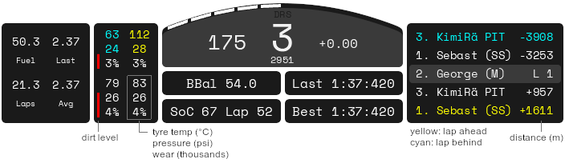

# Dashboard

A dashboard for Assetto Corsa.

## Thanks to

* Rubik for [sim_info.py](https://www.assettocorsa.net/forum/index.php?threads/shared-memory-for-python-applications-sim_info-py-for-ac-v0-22.11382/)

* Colophon Foundry for the font [Space Mono](https://fonts.google.com/specimen/Space+Mono/about)

## Installation

1. Copy `dashboard` to `assettocorsa/apps/python`

2. Copy `SpaceMono-Regular.ttf` to `assettocorsa/content/fonts`

3. Enable "dashboard" in the settings:

	* __Assetto Corsa Launcher__: Settings > General > UI Modules

	* __Content Manager__: Settings > Assetto Corsa > Apps